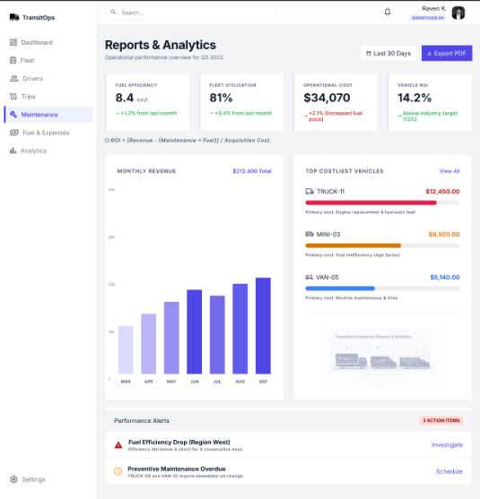
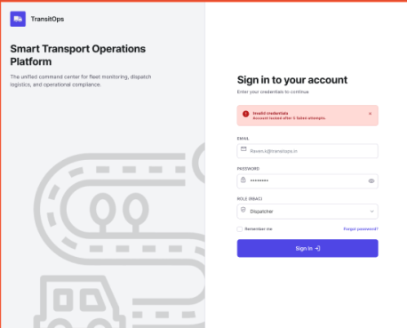
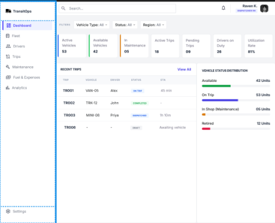
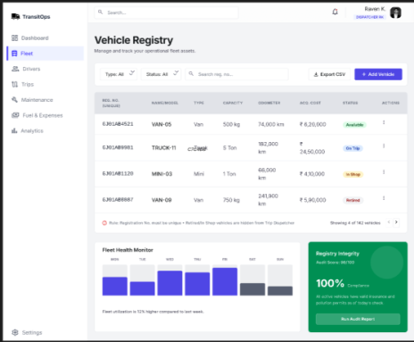

# TransitOps

### Problem Statement

Develop an end-to-end transport operations platform that digitizes vehicle, driver, dispatch, maintenance, and expense management while enforcing strict business rules and providing operational insights[cite: 2]. The system replaces manual spreadsheets to prevent scheduling conflicts, missed maintenance, and expired driver licenses while offering full operational visibility[cite: 2].

### Created by: Team Hangout Warrior

| Name          | Email                      | Role         |
| ------------- | -------------------------- | ------------ |
| Kunal Kumar   | kunal34255@gmail.com       | Team Leader  |
| Naman Kumar   | namansanjaykumar@gmail.com | Frontend Dev |
| Manashi Sheth | manshishth@gmail.com       | UI/UX        |
| Meet Nalwaya  | meetnalwaya@gmail.com      | Frontend Dev |

---

**Video Link: [Video Link](https://drive.google.com/file/d/1L7H9qY9Tjh38FMTSVhlw79RDX1YsKR3S/view?usp=sharing)**

---

---

**Figma Design: [Figma Design](https://www.figma.com/design/O9zMQVwBsIyzoDNxoCmflB/Odoo-Hackathon?node-id=0-1&m=dev)**

---

**Test Credentials:**

- **Dispatcher:** `raven.k@transitops.in` | Password: `Pass@123`[cite: 1]
- **Fleet Manager:** `kavya.nair@transitops.in` | Password: `Pass@123`[cite: 1]
- **Safety Officer:** `meera.iyer@transitops.in` | Password: `Pass@123`[cite: 1]
- **Financial Analyst:** `arjun.mehta@transitops.in` | Password: `Pass@123`[cite: 1]

---

---

## Key Features

### User-Facing Features & Role-Based Access

- **Role-Based Access Control (RBAC):** Supports distinct access levels for Fleet Managers, Dispatchers, Safety Officers, and Financial Analysts[cite: 1, 2].
- **Interactive Dashboard:** Displays live KPIs such as Active Vehicles, Available Vehicles, Vehicles in Maintenance, Active Trips, and Fleet Utilization percentages[cite: 1, 2].
- **Automated Business Rules:** The system strictly enforces constraints, such as ensuring cargo weight cannot exceed a vehicle's maximum load capacity[cite: 1, 2].
- **Dynamic Status Transitions:** Dispatching a trip automatically marks the vehicle and driver as "On Trip", and completing or cancelling the trip restores their status to "Available"[cite: 1, 2].

### Fleet & Maintenance Management

- **Vehicle Registry:** Maintains a master list of fleet assets tracking unique registration numbers, vehicle types, max load capacities, odometers, and acquisition costs[cite: 1, 2].
- **Maintenance Workflows:** Logging a vehicle for maintenance automatically changes its status to "In Shop"[cite: 1, 2].
- **Dispatch Protection:** Retired or "In Shop" vehicles are automatically hidden and blocked from the dispatch selection pool[cite: 1, 2].

### Driver & Safety Compliance

- **Driver Profiles:** Manages driver credentials including license category, contact numbers, and safety scores[cite: 1, 2].
- **Automated Compliance:** Drivers with expired licenses or a "Suspended" status are automatically blocked from being assigned to new trips[cite: 1, 2].

### Financial Tracking & Analytics

- **Trip Lifecycle Management:** Complete end-to-end trip tracking from Draft to Dispatched, and finally to Completed or Cancelled[cite: 1, 2].
- **Fuel & Expense Logs:** Allows users to record fuel consumption (in liters and cost) alongside other expenses like tolls[cite: 1, 2].
- **Operational Reports:** Calculates complex metrics such as Fuel Efficiency (km/L), total Operational Costs, and Vehicle ROI based on acquisition costs and maintenance spend[cite: 1, 2].
- **Exportable Data:** Supports exporting analytics reports to CSV format[cite: 1, 2].

---

## Tech Stack

| Category       | Technology                                                                          |
| -------------- | ----------------------------------------------------------------------------------- |
| **Frontend**   | Next.js (React), Tailwind CSS, React Query, React Hook Form, Zod, Recharts[cite: 1] |
| **Backend**    | Node.js, Express.js, Prisma ORM, Resend (Emails)[cite: 1]                           |
| **Database**   | PostgreSQL (via Supabase)[cite: 1]                                                  |
| **Auth**       | JSON Web Tokens (JWT), bcryptjs[cite: 1]                                            |
| **Deployment** | [Insert Deployment Platform, e.g., Vercel / Render]                                 |

---

## Screenshots

